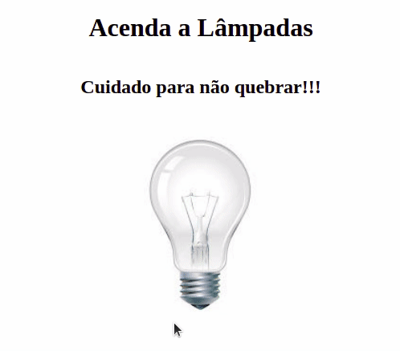

<h4 align="center">
  Um projeto simples para Treinar a programação em JavaScript e manipulação do DOM.
</h4>

## :rocket: Tecnologias

Esse projeto foi desenvolvido com as seguintes tecnologias:

-  [HTML]
-  [Javascript]
-  [CSS]
-  [VS Code]

# Projeto-lampada
